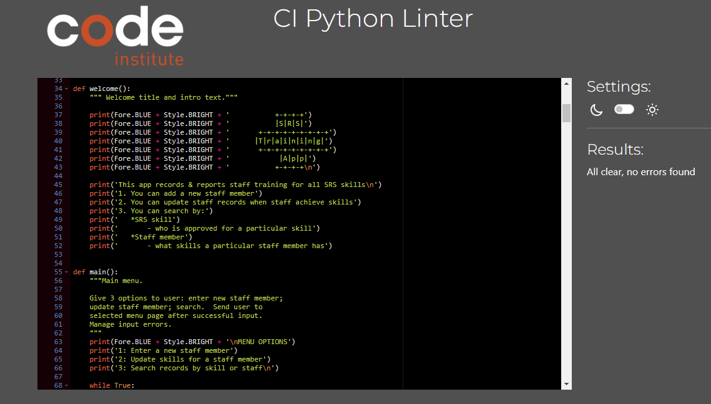

# SRS Training App

## Site Link: <a href="" target="_blank">SRS Training App</a>

1. [Introduction](#introduction)
2. [User Experience](#user-experience)
3. [Technical Design](#technical-design)
4. [Features](#features)
5. [Future Features](#future-features)
6. [Testing](#testing)
    1. [Validator Testing](#validator-testing)
    2. [Manual Testing](#manual-testing)
7. [Bugs](#bugs)
    1. [Known Bugs](#known-bugs)
    2. [Solved Bugs](#solved-bugs)
8. [Deployment](#deployment)
    1. [Github](#github)
    2. [Heroku](#heroku)
9. [Credits](#credits)
    1. [Code Used](#code-used)
    2. [Content](#content)
    3. [Technologies Used](#technologies-used)
10. [Acknowledgements](#acknowledgements)

## Site Link: (https://srs-training-tracker.herokuapp.com/)

# INTRODUCTION

    This application is developed to assist a manager in a busy clinical hospital environment, by tracking staff skill training, and allowing the user to query staff and skills as needed.  
    
    Stereotactic Radiosurgery (SRS) is a highly skilled discpline.  in a busy Radiotherapy department it can be difficult to ensure enough staff are trained in the various sub-techniques (skills) of SRS, and to track who is trained in which area.  Along with this difficulty there can be frequent challenges maintaining a suitable staff base to deliver treatment, particular due to factors such as covid, high staff turnover, and other unexpected staffing shortages, and a manager is often required to adjust staffing across various units at short notice.  
    
    This application is designed to record the training of staff members in each or any SRS skill they are trained in.  This acts as a training record for each staff member.  This is also a daily tool for the person managing the skill mix of the department - if there is a roster shortage the user can search the app for available staff members to see if their skills match the need for the day, or search by staff member to see if an available staff member has the required skills.  This can improve staffing decisions by providing the required information in an easy to access manner, and reduce stress as managers don't have to memorise what skill each staff member possesses (particularly in cases where the skill is not often applied clinically).

# User Experience

As a new user I want to:
* ...
* ...

As a returning user I want to:
* ...
* ...

# Technical Design

## Flowchart

Designed at planning stage of application, the chart was used to guide thedevelopment process while building the application.  The initial flowchart closely reflects the structure of the finished application.

SRS Training App Flowchart

    

## Data Models
Functional python - OOP could be implemented within this program to take advantage of classes, objects etc...

# Features

* Info on all application features (with screenshots), incorporating user stories.

## Welcome page & Description

Welcome page

    

Start Program & welcome
instructions
menu 1 - 3 options
option 1 - add new trainee
option 2 - update existing trainee
option 3 - search training status (staff, skill)

# Future Features

* Administrator log-in with password to restrict application use/misuse
* Ability to inactivate staff members (e.g. at end of service, maternity leave)
* 3-tier training status per skill (basic, advanced, expert)
* Ability to search by staff position
* Ability to view the date skill was entered (this data is currently available in the spreadsheets & ready for future implementation)
* Display staff and/or skills in order (numerical or alphabetical as relevant)
* Display all staff & skills in one table
* Expand for other sub-specialities, such as adding a module for tracking virtual simulation skills
* Improve visual layout of application with screen centering and background image

# TESTING

## Validator Testing

The code was regularly tested using the Code Institute PEP Validator substitute:
<a href="https://pep8ci.herokuapp.com/" target="_blank">CI Python Linter</a>

CI Python Linter Results

    

## Manual Testing

# Welcome Menu
| Feature   | Action                                               | Expected Result                                                         | Actual Result     |
|-----------|------------------------------------------------------|-------------------------------------------------------------------------|-------------------|
| Main Menu | Select 0 to exit                                     | Exits program                                                           | Works as expected |
| Main Menu |  Select  1 to enter new staff member                 | Sends user to: Enter new staff member section                           | Works as expected |
| Main Menu |  Select  2 to update skills for  a staff member      | Sends user to: Find staff member section                                | Works as expected |
| Main Menu | Select 3 to search records by  skill or staff member | Sends user to: Search menu options section                              | Works as expected |
| Main Menu | Select number other than 0-3                         | Warning message to user:  "Please choose number 0 -3 from the menu"     | Works as expected |
| Main Menu | Select non-number input e.g. 'g'                     | Warning message to user:  "Please choose a number (only) from the menu" | Works as expected |

# BUGS

## Known Bugs
 * info about bugs fixed and bugs remaining goes here...

 ## Solved Bugs
 * info about bugs fixed and bugs remaining goes here...

# DEPLOYMENT

This site can be forked using Github as follows (to make a copy in your own repo)

## Github

2. Go to **Fork** button on the right-side ribbon menu (between **Unwatch** and **Star**)
3. Click the button to make a copy automatically into your own respository
4. **Owner** will default to your own github name
5. Add a repository name and an optional  
5. Add a repository name and an optional description 
6. Select **Create Fork** button

This site can be cloned using Github as follows (to make a copy on your own machine):

1. Enter the relevant Github repository
2. Click the green **Code** from the menu (to the left of the green **Gitpod** button)
2. Click the green **Code** button from the menu (to the left of the green **Gitpod** button)
3. Copy the link under https (to copy using HTTPS)
4. Open git bash on your own machine, and select the directory you want to save into
5. Type 'git clone' then copy in your link
The site github link is here: 

## Heroku

### In Github
1. Ensure all input methods have a new line at the end of the text (due to software behaviour of the mock terminal)
2. Create requirements.txt file so Heroku can load required dependancies
    - in workspace terminal, type 'Pip3 freeze > requirements.txt' to automatically update the requirements.txt file
    - push to GitHub

### In Heroku
1. In Heroku dashboard click **Create New App** button
2. Give app a unique name
3. Select region e.g. **Europe**
4. Click **Create App**
5. Go to **Settings** tab
6. Add **Config Vars**:
    1. Click on **Reveal Config Vars** button
    2. Type **CREDS** in the **KEY** field
    3. Copy & paste the contents of the **creds.json** file from github workspace into the **VALUE** field
    4. Click **Add* button
    5. In the next config var row, type **PORT** in the **KEY** field, and add **8000** to the **VALUE** field
7. Add **Buildpacks**:
    1. Click **Add Buildpack** button
    2. Click **Python** in pop-up window and click **Save changes**
    3. Click **Add Buildpack** button again
    4. Click **nodejs** in pop-up window and click **Save changes**
    5. Ensure python buildpack is first in the list (click and drag to re-order if needed)
8. Go to **Deploy** tab
    1. Click on **Github** icon
    2. Click on **Connect to Github** button
    3. In search field, search for repo name and click **Search**
    4. Click **Connect** button
    5. Scroll to bottom of page to select deployment method
        * Click **Deploy Branch** to manually deploy, ensuring desired branch is selected
        * Click **Enable Automatic Deploys** to enable automatic deployment based on every git push (ensuring desired branch is selected)
        6. Click **View** to go to deployed link

# CREDITS

## Code

- <a href="" target="_blank">Test</a>

- <a href="" target="_blank">Test</a>

- <a href="" target="_blank">Test</a>

- <a href="" target="_blank">Test</a>

- <a href="" target="_blank">Test</a>

- <a href="" target="_blank">Test</a>

- Code Institute - deployment process for Heroku, API set-up, use of creds etc

## Contents
All written content was created by the site author based on professional knowledge.  All code was written by the site author.

## Technologies Used

Languages
- <a href="https://www.python.org/" target="_blank">Python</a>

Libraries
- <a href="https://docs.python.org/3/library/os.html" target="_blank">OS</a> Gives functions for interacting with the operating system.  Allows use of clear screen function (used to improve user experience to declutter screen).
- <a href="https://docs.python.org/3/library/sys.html" target="_blank">Sys</a> Interacts with the runtime environment.
- <a href="https://docs.python.org/3/library/datetime.html" target="_blank">Datetime</a> For getting & manipulation dates & time.  The date is added to the database when user adds a skill.  The date display (attached to a skill & user) will be implemented in user display in future versions of the applicationn.
- <a href="https://docs.python.org/3/library/time.html" target="_blank">Time </a> Sleep was imported from Time to give a delay when sending information to worksheets, to enhance user experience (gives impression program is doing "work".)
- <a href="https://docs.gspread.org/en/v5.7.2/" target="_blank">Gspread</a> An API for google sheets, used to enable interaction between sheet and application.
- <a href="https://pypi.org/project/colorama/" target="_blank">Colorama</a> Used to enhance user experience & expectations by colouring warnings red, menus and important information in blue, and input sections in green.
- <a href="https://google-auth.readthedocs.io/en/master/reference/google.oauth2.service_account.html" target="_blank">google-auth</a> Enables service account between application and google service.

During the creation of this site I used the following technologies:

- <a href="https://github.com/" target="_blank">Git Hub</a> used for online programming, change tracking and storage respository for this project
- <a href="https://www.heroku.com/" target="_blank">Heroku</a> cloud platform service to deploy, use & manage the application.
- <a href="https://www.google.com/sheets/about/" target="_blank">Google Sheets</a> used as online spreadsheet editor to store application data.
- <a href="https://console.cloud.google.com/" target="_blank">Google Cloud Services</a> used as public cloud service.
-  <a href="https://app.diagrams.net/">Draw.io</a> for flowchart creation during devlopment phase.
- <a href="https://patorjk.com/" target="_blank">ASCII art generator</a> used to generate the welcome title.
- <a href="https://tablesgenerator.com/markdown_tables" target="_blank">Tables Generator</a> used to create tables in manual testing section for README.

# Acknowledgements
Thanks to my mentor Maranatha Ilesanmi for his advice and support, and my fellow students on Slack for advice and colleagiality.

<a href="" target="_blank">Test</a>