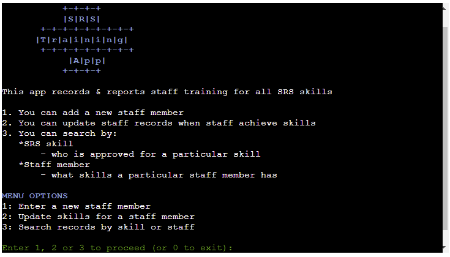
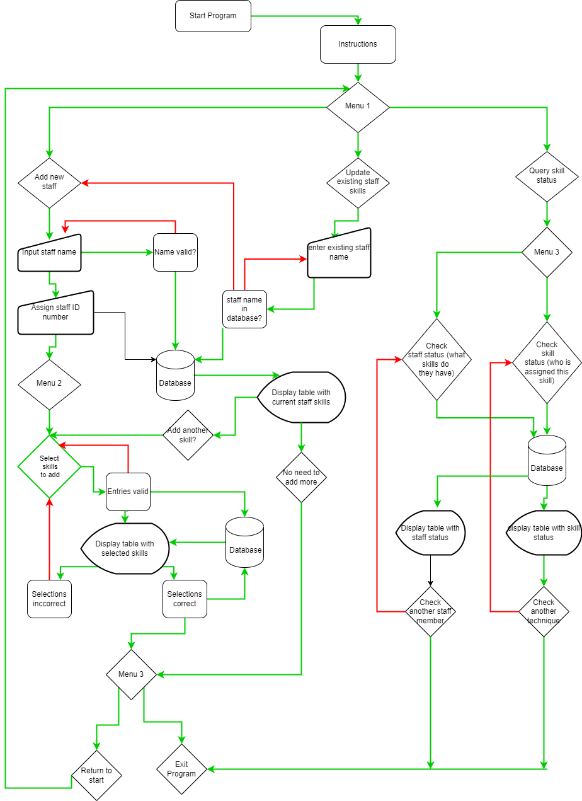

# SRS Training App

## Site Link: <a href="" target="_blank">SRS Training App</a>

1. [Introduction](#introduction)
2. [User Experience](#user-experience)
3. [Technical Design](#technical-design)
4. [Features](#features)
5. [Future Features](#future-features)
6. [Testing](#testing)
    1. [Validator Testing](#validator-testing)
    2. [Manual Testing](#manual-testing)
7. [Bugs](#bugs)
    1. [Known Bugs](#known-bugs)
    2. [Solved Bugs](#solved-bugs)
8. [Deployment](#deployment)
    1. [Github](#github)
    2. [Heroku](#heroku)
9. [Credits](#credits)
    1. [Code Used](#code-used)
    2. [Content](#content)
    3. [Technologies Used](#technologies-used)
10. [Acknowledgements](#acknowledgements)

## Site Link: (https://srs-training-tracker.herokuapp.com/)

# INTRODUCTION

This application is developed to assist a manager in a busy clinical hospital environment, by tracking staff skill training, and allowing the user to query staff and skills as needed.  
    
Stereotactic Radiosurgery (SRS) is a highly skilled discpline.  in a busy Radiotherapy department it can be difficult to ensure enough staff are trained in the various sub-techniques (skills) of SRS, and to track who is trained in which area.  Along with this difficulty there can be frequent challenges maintaining a suitable staff base to deliver treatment, particular due to factors such as covid, high staff turnover, and other unexpected staffing shortages, and a manager is often required to adjust staffing across various units at short notice.  
    
This application is designed to record the training of staff members in each or any SRS skill they are trained in.  This acts as a training record for each staff member.  This is also a daily tool for the person managing the skill mix of the department - if there is a roster shortage the user can search the app for available staff members to see if their skills match the need for the day (with staff position displayed to aid in roster decision making), or search by staff member to see if an available staff member has the required skills.  This can improve staffing decisions by providing the required information in an easy to access manner, and reduce stress as managers don't have to memorise what skill each staff member possesses (particularly in cases where the skill is not often applied clinically).

# User Experience

## User Experience

### Target Audience
Managers and senior clinical staff responsible for staff training, and staff rostering, within the designated clinical area.

## User Stories

As a user I want to:

1. Understand how the application works
    - so I can use it successfully
2. Be given feedback if my input is successful
    - so I know the application is working
3. be given feedback if my input is incorrect
    - so I know if I'm using the application correctly
4. Search for staff by name
    - so I don't have to remember staff ids
5. Add a new staff member
    - to track newly trained staff members
6. Add skills for a staff member
    - to update staff records for accuracy
7. Search for a staff member to see what skills they have
    - so I know if I can roster a staff member to treat a certain technique
8. Search for a skill to see which staff have that skill
    - so I can find staff to treat a certain technique
9. see staff positions when presented with a list of staff who have a selected skill
     - so I can consider skill mix when rostering staff

As the site owner I want:

10. Information storage to be spreadsheet based
    - to allow for efficient data storage and retrieval
11. User input to be validated
    - so I know the data being collected is useful & relevant
12. The user to be given feedback if their entry/search is successful
    - so they know the application is working
13. The user to be given feedback if their input is incorrect
    - to help them input good data
14.  want the user to be able to search for skills or staff 
    - to facilitate training monitoring and rostering decisions

# Technical Design

## Flowchart

Designed at planning stage of application, the chart was used to guide thedevelopment process while building the application.  The initial flowchart closely reflects the structure of the finished application.

SRS Training App Flowchart

    

## Data Models

Functional programming was used as the primary approach for development of this application. OOP could have be employed an an effective alternative to manage staff as a class.  One global variable was used in the application - it is acknowledged that is not considered best practice, and would be refactored in a future version of this application.

# Features

* Info on all application features (with screenshots), incorporating user stories.

## Welcome page & Description

Welcome page

    

## 

Start Program & welcome
instructions
menu 1 - 3 options
option 1 - add new trainee
option 2 - update existing trainee
option 3 - search training status (staff, skill)

# Future Features

* Administrator log-in with password to restrict application use/misuse
* Ability to inactivate staff members (e.g. at end of service, maternity leave)
* 3-tier training status per skill (basic, advanced, expert)
* Ability to search by staff position
* Ability to view the date skill was entered (this data is currently available in the spreadsheets & ready for future implementation)
* Display staff and/or skills in order (numerical or alphabetical as relevant)
* Display all staff & skills in one table
* Expand for other sub-specialities, such as adding a module for tracking virtual simulation skills
* Improve visual layout of application with screen centering and background image

# TESTING

## Validator Testing

The code was regularly tested using the Code Institute PEP Validator substitute:
<a href="https://pep8ci.herokuapp.com/" target="_blank">CI Python Linter</a>

CI Python Linter Results

    

## Manual Testing

# Welcome Menu
| Feature | Action | Expected Result | Actual Result |
|---|---|---|---|
| Main Menu | Select 0 to exit | Exits program | Works as expected |
| Main Menu |  Select  1 to enter new staff member | Sends user to: Enter new staff member section  | Works as expected |
| Main Menu |  Select  2 to update skills for  a staff member | Sends user to: Find staff member section | Works as expected |
| Main Menu | Select 3 to search records by  skill or staff member | Sends user to: Search menu options section | Works as expected |
| Main Menu | Select number other than 0-3 | Warning message to user:  "Please choose number 0 -3 from the menu" | Works as expected |
| Main Menu | Select non-number input e.g. 'g' | Warning message to user: "Please choose a number (only) from the menu" | Works as expected |

#  Enter new staff member

| Feature | Action | Expected Result | Actual Result |
|---|---|---|---|
| User input prompts | Enter first name, last name & position in successive input prompts | Validation of input occurs | Works as expected |
| Input validation | Entry of a non-alpha character in any of above fields | Warning to user, specifying the first invalid entry Menu option to exit or try again | Works as expected |
| Menu option to exit or try again | User selects 0 or 1 | Reloads user input prompts (first/last names, position) or returns to main menu | Works as expected |
| Present user with inputted data  | User prompted to confirm if entry correct or not  | No = Menu option to try again or go to main menu Yes = success message, returns user to main menu | Works as expected |
| Final validation  | User inputs invalid number or invalid alpha characters to confirmation query | Warning to user Menu option to exit or try again | Works as expected |
| Final validation  | User inputs previously registered staff member | Warning to user re duplication, Menu option to exit or try again | Works as expected |

# Update skills for existing staff member
| Feature | Action | Expected Result | Actual Result |
|---|---|---|---|
| User input prompts | Enter first name, last name in successive input prompts | Validation of input occurs | Works as expected |
| Input validation | User enters name (using alpha characters) for staff that is not registered | Warning to user (staff does not exist). Menu options: main menu, search menu, try again   | Works as expected |
|  | User enters number in first name field for staff | Warning to user, menu options try again or go to main menu | Bug found - see bug 1 |
|  | User enters number in last name field for staff | Warning to user, menu options try again or go to main menu | Works as expected |
|  | User enters existing staff name correctly | User skills are displayed, list of skills to add display, option to enter more skills presented | Works as expected |
| Enter skill | User enters skill number from list | Skill added, confirmation text shown, option to accept or reject (Y/N) | Works as expected |
|  | User enters duplicate skill number from list | Warning to user, return to skill entry | Works as expected |
|  | User enters incorrect number or a letter | Warning to user, skills list re-presented, enter skill prompt | Works as expected |
|  | User selects No to confirm skill selected is not what intended | Skill list reloaded, input skill requested again | Works as expected |
|  | User selects Yes to add skill | Option to add further skill given | Works as expected |
| Option to enter further skill | User chooses from menu option to enter skill or not (Y/N) | Staff skills and skill list re-presented if Y, return to main menu if N | Works as expected |
|  |  |  |  |

# Search Records by Skill or Staff Member Menu
| Feature | Action | Expected Result | Actual Result |
|---|---|---|---|
| Menu options | User selects 1 for staff search, 2 for skill search, 0 for main menu | Selected menu loads | Works as expected |
| Input validation | User selects a letter or invalid number | Warning message to user, menu reloads | Works as expected |

# Staff Search
| Feature | Action | Expected Result | Actual Result |
|---|---|---|---|
| User input prompts | Enter first name, last name in successive input prompts | Validation of input occurs | Works as expected |
| Input validation | User enters name (using alpha characters) for staff that is not registered | Warning to user (staff does not exist). Menu options: main menu, search menu, try again   | Works as expected |
|  | User enters number in first name field for staff | Warning to user, menu options try again or go to main menu | Bug found - see bug 1 |
|  | User enters number in last name field for staff | Warning to user, menu options try again or go to main menu | Works as expected |
|  | User enters existing staff name correctly | User skills are displayed, menu presented to search for another staff member, add skills to this staff member, return to main menu | Works as expected |
| Search staff again| User performs search for different staff member | Search works as previously | Works as expected |
|  | User enters incorrect number or a letter | Warning to user, search menu re-presented | Works as expected |
|  |  |  |  |

# Skill Search
| Feature | Action | Expected Result | Actual Result |
|---|---|---|---|
| Menu options | Skills list displayed, user prompted to enter skill number | List of staff with skill (and staff position) is displayed | Works as expected |
| Input validation | User selects a letter or invalid number | Warning message to user, menu reloads | Works as expected |
| Menu options | Search menu displayed,  user prompted to go to staff or skill search or main menu | User directed to selected menu | Works as expected |

# BUGS

## Known Bugs
 1. When searching for existing staff member to update skills - if a user enters a number in the first name field (but not the last name field), then selects try again, the name input is re-presented to user.  If user then enters a known existing user, the application returns warning to user that staff does not exist. if user then searches for same staff again the search is then successful.
 2. When updating skills for a user unwanted decoration is displayed at the top of the screen
 3. When entering a second skill for a user the skills list (for selection reference) does not display
 4. If there are no staff with a skill, no message is given to user (system returns to search menu)

 ## Solved Bugs
1. Early testing showed that user could not break out of loops when searching for staff name that could not be found, or unsuccessfully trying to add a new user (through entry error or searching for staff that did not exist).  Loop breaker functions were added to give user option to continue trying or return to main menu in these cases.
 2. Validation checks for number entries (e.g. selecting 1-9 for a skill search) did not include a check for entry of '0'.  Code was amended to include 0 e.g. changed from  'if int(skill_to_input) <= len(skills.get_all_values())' to 'if 0 < int(skill_to_input) <= len(skills.get_all_values())'.
 3. When user received a warning, the menu options presented (e.g. 'select 1 to try again, 0 to exit' ) controlled for user entering an invalid number, but not for a letter e.g. 'g' (which gave a value error).  All loop breaker functions were amended to try/except/else blocks with value error raised in the exception clause to solve this.
 4.  When user searched for a staff member, this worked correctly the first time, however if user searched for another staff member they were incorrectly given a warning and presented with menu options.  To solve this the try/except blocks were changed in the get_id_breaker and find_staff_breaker functions to move the else clause (checking for number errors) into the try block, instead of placing this after the except clause.
 5.  When searching for staff skills no message was given to the user if the staff member had no skills logged (i.e. nothing to display). To correct: added an empty key_dict to display_staff_skills(). If skill exists item added to key_dict, and if key dict false (empty) then warning printed to user re no skills.

# DEPLOYMENT

This site can be forked using Github as follows (to make a copy in your own repo)

## Github

2. Go to **Fork** button on the right-side ribbon menu (between **Unwatch** and **Star**)
3. Click the button to make a copy automatically into your own respository
4. **Owner** will default to your own github name
5. Add a repository name and an optional  
5. Add a repository name and an optional description 
6. Select **Create Fork** button

This site can be cloned using Github as follows (to make a copy on your own machine):

1. Enter the relevant Github repository
2. Click the green **Code** from the menu (to the left of the green **Gitpod** button)
2. Click the green **Code** button from the menu (to the left of the green **Gitpod** button)
3. Copy the link under https (to copy using HTTPS)
4. Open git bash on your own machine, and select the directory you want to save into
5. Type 'git clone' then copy in your link
The site github link is here: 

## Heroku

### In Github
1. Ensure all input methods have a new line at the end of the text (due to software behaviour of the mock terminal)
2. Create requirements.txt file so Heroku can load required dependancies
    - in workspace terminal, type 'Pip3 freeze > requirements.txt' to automatically update the requirements.txt file
    - push to GitHub

### In Heroku
1. In Heroku dashboard click **Create New App** button
2. Give app a unique name
3. Select region e.g. **Europe**
4. Click **Create App**
5. Go to **Settings** tab
6. Add **Config Vars**:
    1. Click on **Reveal Config Vars** button
    2. Type **CREDS** in the **KEY** field
    3. Copy & paste the contents of the **creds.json** file from github workspace into the **VALUE** field
    4. Click **Add* button
    5. In the next config var row, type **PORT** in the **KEY** field, and add **8000** to the **VALUE** field
7. Add **Buildpacks**:
    1. Click **Add Buildpack** button
    2. Click **Python** in pop-up window and click **Save changes**
    3. Click **Add Buildpack** button again
    4. Click **nodejs** in pop-up window and click **Save changes**
    5. Ensure python buildpack is first in the list (click and drag to re-order if needed)
8. Go to **Deploy** tab
    1. Click on **Github** icon
    2. Click on **Connect to Github** button
    3. In search field, search for repo name and click **Search**
    4. Click **Connect** button
    5. Scroll to bottom of page to select deployment method
        * Click **Deploy Branch** to manually deploy, ensuring desired branch is selected
        * Click **Enable Automatic Deploys** to enable automatic deployment based on every git push (ensuring desired branch is selected)
        6. Click **View** to go to deployed link

# CREDITS

## Code

- Guidance on the use of colorama was from <a href="https://www.pythonpool.com/python-colorama/" target="_blank">pythonpool</a>

- Idea for truth value testing to solve 'Solved Bug #5' from <a href="https://flexiple.com/python/check-if-list-is-empty-python/#section2" target="_blank">flexiple</a>

- Working with lists and dictionaries was initally guided by <a href="https://blog.finxter.com/python-list-of-lists/" target="_blank">finxter</a>

- List to dictionary conversions were informed by <a href="https://builtin.com/software-engineering-perspectives/convert-list-to-dictionary-python" target="_blank">builtin</a>

- Code Institute Love Sandwiches walk-through - API set-up, scoping, creds

## Contents
All written content was created by the site author based on professional knowledge.  All code was written by the site author.

## Technologies Used

Languages
- <a href="https://www.python.org/" target="_blank">Python</a>

Libraries
- <a href="https://docs.python.org/3/library/os.html" target="_blank">OS</a> Gives functions for interacting with the operating system.  Allows use of clear screen function (used to improve user experience to declutter screen).
- <a href="https://docs.python.org/3/library/sys.html" target="_blank">Sys</a> Interacts with the runtime environment.
- <a href="https://docs.python.org/3/library/datetime.html" target="_blank">Datetime</a> For getting & manipulation dates & time.  The date is added to the database when user adds a skill.  The date display (attached to a skill & user) will be implemented in user display in future versions of the applicationn.
- <a href="https://docs.python.org/3/library/time.html" target="_blank">Time </a> Sleep was imported from Time to give a delay when sending information to worksheets, to enhance user experience (gives impression program is doing "work".)
- <a href="https://docs.gspread.org/en/v5.7.2/" target="_blank">Gspread</a> An API for google sheets, used to enable interaction between sheet and application.
- <a href="https://pypi.org/project/colorama/" target="_blank">Colorama</a> Used to enhance user experience & expectations by colouring warnings red, menus and important information in blue, and input sections in green.
- <a href="https://google-auth.readthedocs.io/en/master/reference/google.oauth2.service_account.html" target="_blank">google-auth</a> Enables service account between application and google service.

During the creation of this site I used the following technologies:

- <a href="https://github.com/" target="_blank">Git Hub</a> used for online programming, change tracking and storage respository for this project
- <a href="https://www.heroku.com/" target="_blank">Heroku</a> cloud platform service to deploy, use & manage the application.
- <a href="https://www.google.com/sheets/about/" target="_blank">Google Sheets</a> used as online spreadsheet editor to store application data.
- <a href="https://console.cloud.google.com/" target="_blank">Google Cloud Services</a> used as public cloud service.
-  <a href="https://app.diagrams.net/">Draw.io</a> for flowchart creation during devlopment phase.
- <a href="https://patorjk.com/" target="_blank">ASCII art generator</a> used to generate the welcome title.
- <a href="https://tablesgenerator.com/markdown_tables" target="_blank">Tables Generator</a> used to create tables in manual testing section for README.

# Acknowledgements
Thanks to my mentor Maranatha Ilesanmi for his advice and support, and my fellow students on Slack for advice and colleagiality.

<a href="" target="_blank">Test</a>